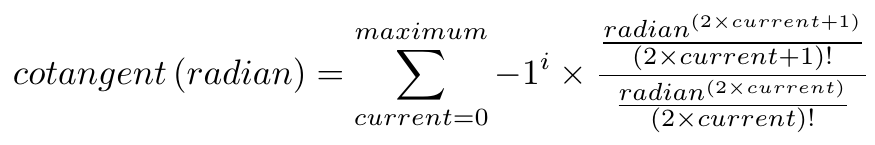
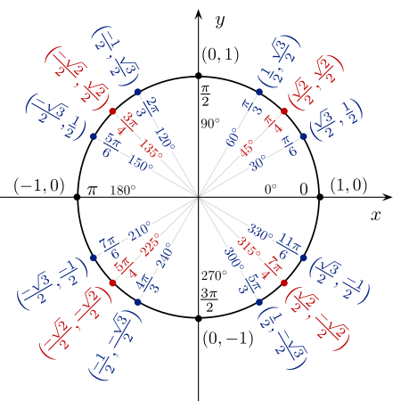

# Trigonometric Functions
Analysis and thinking about trigonometry functions and how they work.

## Sine


```
\begin{equation}
  sine \left(radian\right) = 
  \sum_{current=0}^{maximum}{
    -1 ^ i  \times
    \frac{
      radian ^ {\left( 2\times current +1 \right)}
    }{
      \left( 2 \times current + 1 \right) !
    }
  }
\end{equation}
```

### Maximum

#### maximum = 1

| Degree  | Radian | 	Response 	   |	 Expected response 	   | Correct answer |
| ------- | ------ | ----------------- | ------------------------- | ---------- |
| 0       |        | 0                 |  0                         | [x] |
| 20      |        | 0.349066           | 0.342020143                          | [ ] |
| 45      |        | 0.875398          |  0.707106781                         | [ ] |
| 80      |        | 1.39626          | 0.984807753                          | [ ] |
| 90      |        | 1.5708                 | 1                          | [ ] |
| 120     |        | 2.0944          | 0.866025404                          | [ ] |
| 180     |        | 3.14159        | 0                          | [ ] |
| 270     |        | 4.71239         | −1                          | [ ] |
| 360     |        | 0                 | 0                          | [x] |

#### maximum = 7

| Degree  | Radian | 	Response 	   |	 Expected response 	   | Correct answer |
| ------- | ------ | ----------------- | ------------------------- | --------- |
| 0       |        | 0                 | 0                          | [x] |
| 20      |        | 0.34202           | 0.342020143                          | [x] |
| 45      |        | 0.707107          | 0.707106781                          | [x] |
| 80      |        | 0.984808          | 0.984807753                          | [x] |
| 90      |        | 1                 | 1                          | [x] |
| 120     |        | 0.866031          | 0.866025404                          | [x] |
| 180     |        | 0.00105761        | 0                          | [ ] |
| 270     |        | -0.789398         | −1                          | [ ] |
| 360     |        | 0                 | 0                          | [x] |


#### maximum = 15

| Degree  | Radian | 	Response 	   |	 Expected response 	   | Correct answer |
| ------- | ------ | ----------------- | ------------------------- | -------- |
| 0       |        | 0                 | 0                          | [x] |
| 20      |        | 0.34202           | 0.342020143                          | [x] |
| 45      |        | 0.707107          | 0.707106781                          | [x] |
| 80      |        | 0.984782          | 0.984807753                          | [x] |
| 90      |        | 0.999408                 | 1                          | [ ] |
| 120     |        | -1.08921          | 0.866025404                          | [ ] |
| 180     |        | -227481        | 0                          | [ ] |
| 270     |        | -2.79025e+010         | −1                          | [ ] |
| 360     |        | 0                 | 0                          | [x] |

#### maximum = 17

| Degree  | Radian | 	Response 	   |	 Expected response 	   | Correct answer |
| ------- | ------ | ----------------- | ------------------------- | ------------ |
| 0       |        | 0                 | 0                          | [x] |
| 20      |        | 0.34202           | 0.342020143                          | [x] |
| 45      |        | 0.707107          | 0.707106781                          | [x] |
| 80      |        | 0.984711          | 0.984807753                          | [x] |
| 90      |        | 0.9964                 | 1                          | [ ] |
| 120     |        | -31.5645          | 0.866025404                          | [ ] |
| 180     |        | -1.55808e+007        | 0                          | [ ] |
| 270     |        | -8.70732e+012         | −1                          | [ ] |
| 360     |        | 0                 | 0                          | [x] |


#### maximum = 20

| Degree  | Radian | 	Response 	   |	 Expected response 	   | Correct answer |
| ------- | ------ | ----------------- | ------------------------- | ---- |
| 0       |        | 0                 | 0                          | [x] |
| 20      |        | 0.34202           | 0.342020143                          | [x] |
| 45      |        | 0.707107          | 0.707106781                          | [x] |
| 80      |        | 0.984808          | 0.984807753                          | [x] |
| 90      |        | 1                 | 1                          | [x] |
| 120     |        | 0.866025          | 0.866025404                          | [x] |
| 180     |        | -5.28918e-010        | 0                          | [ ] |
| 270     |        | -1         | −1                          | [x] |
| 360     |        | 0                 | 0                          | [x] |


#### maximum = 40

| Degree  | Radian | 	Response 	   |	 Expected response 	   | Correct answer |
| ------- | ------ | ----------------- | ------------------------- | -------------- |
| 0       |        | 0                 | 0                          | [x] |
| 20      |        | 0.34202           | 0.342020143                          | [x] |
| 45      |        | 0.707107          | 0.707106781                          | [x] |
| 80      |        | 0.984808          | 0.984807753                          | [x] |
| 90      |        | 1                 | 1                          | [x] |
| 120     |        | 0.866025          | 0.866025404                          | [x] |
| 180     |        | 3.32806e-016        | 0                          | [ ] |
| 270     |        | -1         | −1                          | [x] |
| 360     |        | 0                 | 0                          | [x] |


## Cosine


```
\begin{equation}
  cosine \left(radian\right) = 
  \sum_{current=0}^{maximum}{
    -1 ^ i  \times
    \frac{
      radian ^ {\left( 2\times current \right)}
    }{
      \left( 2 \times current \right) !
    }
  }
\end{equation}
```

## Tangent


```
\begin{equation}
  tangent\left(radian\right) = 
  \sum_{current=0}^{maximum}{
    -1 ^ i  \times
    \frac{
      \frac{
        radian ^ {\left( 2\times current \right)}
      }{
        \left( 2 \times current \right) !
      }
    }{
      \frac{
        radian ^ {\left( 2\times current +1 \right)}
      }{
        \left( 2 \times current + 1 \right) !
      }
    }
  }
\end{equation}
```

## Cotangent



```
\begin{equation}
  cotangent \left(radian\right) = 
  \sum_{current=0}^{maximum}{
    -1 ^ i  \times
    \frac{
      \frac{
        radian ^ {\left( 2\times current +1 \right)}
      }{
        \left( 2 \times current + 1 \right) !
      }
    }{
      \frac{
        radian ^ {\left( 2\times current \right)}
      }{
        \left( 2 \times current \right) !
      }
    }
  }
\end{equation}
```

# Relationships and Converters




The source of this image is Wikipedia.

```
\begin{equation}
	cosine \left( - A \right) = 
	cosine \left( A\right)
\end{equation}
```
```
\begin{equation}
	sine \left( - A \right) = 
	- sine \left( A\right)
\end{equation}
```
```
\begin{equation}
	cotangent \left(A \right) = 
	tangent \left( \frac{\pi}{2}  - A\right)
\end{equation}
```
```
\begin{equation}
	secant \left(A \right) = 
	cosecant \left( \frac{\pi}{2}  - A\right)
\end{equation}
```
```
\begin{equation}
	cosecant \left(A \right) = 
	secant \left( \frac{\pi}{2}  - A\right)
\end{equation}
```
```
\begin{equation}
	tan \left(A \right) = 
	cot \left( \frac{\pi}{2}  - A\right)
\end{equation}
```

### An example of conversion and analysis algorithms

**> 0 degree**
```
sin(0) = sin(0) = 0
```
**> 1 degree**
```
sin(1) = sin(1) = 0.0174524
```
**> 2 degree**
```
sin(2) = sin(2) = 0.0348995
```
**> 3 degree**
```
sin(3) = sin(3) = 0.052336
```
**> 4 degree**
```
sin(4) = sin(4) = 0.0697565
```
**> 5 degree**
```
sin(5) = sin(5) = 0.0871557
```
**> 6 degree**
```
sin(6) = sin(6) = 0.104528
```
**> 7 degree**
```
sin(7) = sin(7) = 0.121869
```
**> 8 degree**
```
sin(8) = sin(8) = 0.139173
```
**> 9 degree**
```
sin(9) = sin(9) = 0.156434
```
**> 10 degree**
```
sin(10) = sin(10) = 0.173648
```
**> 11 degree**
```
sin(11) = sin(11) = 0.190809
```
**> 12 degree**
```
sin(12) = sin(12) = 0.207912
```
**> 13 degree**
```
sin(13) = sin(13) = 0.224951
```
**> 14 degree**
```
sin(14) = sin(14) = 0.241922
```
**> 15 degree**
```
sin(15) = sin(15) = 0.258819
```
**> 16 degree**
```
sin(16) = sin(16) = 0.275637
```
**> 17 degree**
```
sin(17) = sin(17) = 0.292372
```
**> 18 degree**
```
sin(18) = sin(18) = 0.309017
```
**> 19 degree**
```
sin(19) = sin(19) = 0.325568
```
**> 20 degree**
```
sin(20) = sin(20) = 0.34202
```
**> 21 degree**
```
sin(21) = sin(21) = 0.358368
```
**> 22 degree**
```
sin(22) = sin(22) = 0.374607
```
**> 23 degree**
```
sin(23) = sin(23) = 0.390731
```
**> 24 degree**
```
sin(24) = sin(24) = 0.406737
```
**> 25 degree**
```
sin(25) = sin(25) = 0.422618
```
**> 26 degree**
```
sin(26) = sin(26) = 0.438371
```
**> 27 degree**
```
sin(27) = sin(27) = 0.45399
```
**> 28 degree**
```
sin(28) = sin(28) = 0.469472
```
**> 29 degree**
```
sin(29) = sin(29) = 0.48481
```
**> 30 degree**
```
sin(30) = sin(30) = 0.5
```
**> 31 degree**
```
sin(31) = sin(31) = 0.515038
```
**> 32 degree**
```
sin(32) = sin(32) = 0.529919
```
**> 33 degree**
```
sin(33) = sin(33) = 0.544639
```
**> 34 degree**
```
sin(34) = sin(34) = 0.559193
```
**> 35 degree**
```
sin(35) = sin(35) = 0.573576
```
**> 36 degree**
```
sin(36) = sin(36) = 0.587785
```
**> 37 degree**
```
sin(37) = sin(37) = 0.601815
```
**> 38 degree**
```
sin(38) = sin(38) = 0.615661
```
**> 39 degree**
```
sin(39) = sin(39) = 0.62932
```
**> 40 degree**
```
sin(40) = sin(40) = 0.642788
```
**> 41 degree**
```
sin(41) = sin(41) = 0.656059
```
**> 42 degree**
```
sin(42) = sin(42) = 0.669131
```
**> 43 degree**
```
sin(43) = sin(43) = 0.681998
```
**> 44 degree**
```
sin(44) = sin(44) = 0.694658
```
**> 45 degree**
```
sin(45) = sin(45) = 0.707107
```
**> 46 degree**
```
sin(46) = sin(46) = 0.71934
```
**> 47 degree**
```
sin(47) = sin(47) = 0.731354
```
**> 48 degree**
```
sin(48) = sin(48) = 0.743145
```
**> 49 degree**
```
sin(49) = sin(49) = 0.75471
```
**> 50 degree**
```
sin(50) = sin(50) = 0.766044
```
**> 51 degree**
```
sin(51) = sin(51) = 0.777146
```
**> 52 degree**
```
sin(52) = sin(52) = 0.788011
```
**> 53 degree**
```
sin(53) = sin(53) = 0.798636
```
**> 54 degree**
```
sin(54) = sin(54) = 0.809017
```
**> 55 degree**
```
sin(55) = sin(55) = 0.819152
```
**> 56 degree**
```
sin(56) = sin(56) = 0.829038
```
**> 57 degree**
```
sin(57) = sin(57) = 0.838671
```
**> 58 degree**
```
sin(58) = sin(58) = 0.848048
```
**> 59 degree**
```
sin(59) = sin(59) = 0.857167
```
**> 60 degree**
```
sin(60) = sin(60) = 0.866025
```
**> 61 degree**
```
sin(61) = sin(61) = 0.87462
```
**> 62 degree**
```
sin(62) = sin(62) = 0.882948
```
**> 63 degree**
```
sin(63) = sin(63) = 0.891007
```
**> 64 degree**
```
sin(64) = sin(64) = 0.898794
```
**> 65 degree**
```
sin(65) = sin(65) = 0.906308
```
**> 66 degree**
```
sin(66) = sin(66) = 0.913545
```
**> 67 degree**
```
sin(67) = sin(67) = 0.920505
```
**> 68 degree**
```
sin(68) = sin(68) = 0.927184
```
**> 69 degree**
```
sin(69) = sin(69) = 0.93358
```
**> 70 degree**
```
sin(70) = sin(70) = 0.939693
```
**> 71 degree**
```
sin(71) = sin(71) = 0.945519
```
**> 72 degree**
```
sin(72) = sin(72) = 0.951057
```
**> 73 degree**
```
sin(73) = sin(73) = 0.956305
```
**> 74 degree**
```
sin(74) = sin(74) = 0.961262
```
**> 75 degree**
```
sin(75) = sin(75) = 0.965926
```
**> 76 degree**
```
sin(76) = sin(76) = 0.970296
```
**> 77 degree**
```
sin(77) = sin(77) = 0.97437
```
**> 78 degree**
```
sin(78) = sin(78) = 0.978148
```
**> 79 degree**
```
sin(79) = sin(79) = 0.981627
```
**> 80 degree**
```
sin(80) = sin(80) = 0.984808
```
**> 81 degree**
```
sin(81) = sin(81) = 0.987688
```
**> 82 degree**
```
sin(82) = sin(82) = 0.990268
```
**> 83 degree**
```
sin(83) = sin(83) = 0.992546
```
**> 84 degree**
```
sin(84) = sin(84) = 0.994522
```
**> 85 degree**
```
sin(85) = sin(85) = 0.996195
```
**> 86 degree**
```
sin(86) = sin(86) = 0.997564
```
**> 87 degree**
```
sin(87) = sin(87) = 0.99863
```
**> 88 degree**
```
sin(88) = sin(88) = 0.999391
```
**> 89 degree**
```
sin(89) = sin(89) = 0.999848
```
**> 90 degree**
```
sin(90) = cos(0) = 1
```
**> 91 degree**
```
sin(91) = cos(1) = 0.999848
```
**> 92 degree**
```
sin(92) = cos(2) = 0.999391
```
**> 93 degree**
```
sin(93) = cos(3) = 0.99863
```
**> 94 degree**
```
sin(94) = cos(4) = 0.997564
```
**> 95 degree**
```
sin(95) = cos(5) = 0.996195
```
**> 96 degree**
```
sin(96) = cos(6) = 0.994522
```
**> 97 degree**
```
sin(97) = cos(7) = 0.992546
```
**> 98 degree**
```
sin(98) = cos(8) = 0.990268
```
**> 99 degree**
```
sin(99) = cos(9) = 0.987688
```
**> 100 degree**
```
sin(100) = cos(10) = 0.984808
```
**> 101 degree**
```
sin(101) = cos(11) = 0.981627
```
**> 102 degree**
```
sin(102) = cos(12) = 0.978148
```
**> 103 degree**
```
sin(103) = cos(13) = 0.97437
```
**> 104 degree**
```
sin(104) = cos(14) = 0.970296
```
**> 105 degree**
```
sin(105) = cos(15) = 0.965926
```
**> 106 degree**
```
sin(106) = cos(16) = 0.961262
```
**> 107 degree**
```
sin(107) = cos(17) = 0.956305
```
**> 108 degree**
```
sin(108) = cos(18) = 0.951057
```
**> 109 degree**
```
sin(109) = cos(19) = 0.945519
```
**> 110 degree**
```
sin(110) = cos(20) = 0.939693
```
**> 111 degree**
```
sin(111) = cos(21) = 0.93358
```
**> 112 degree**
```
sin(112) = cos(22) = 0.927184
```
**> 113 degree**
```
sin(113) = cos(23) = 0.920505
```
**> 114 degree**
```
sin(114) = cos(24) = 0.913545
```
**> 115 degree**
```
sin(115) = cos(25) = 0.906308
```
**> 116 degree**
```
sin(116) = cos(26) = 0.898794
```
**> 117 degree**
```
sin(117) = cos(27) = 0.891007
```
**> 118 degree**
```
sin(118) = cos(28) = 0.882948
```
**> 119 degree**
```
sin(119) = cos(29) = 0.87462
```
**> 120 degree**
```
sin(120) = cos(30) = 0.866025
```
**> 121 degree**
```
sin(121) = cos(31) = 0.857167
```
**> 122 degree**
```
sin(122) = cos(32) = 0.848048
```
**> 123 degree**
```
sin(123) = cos(33) = 0.838671
```
**> 124 degree**
```
sin(124) = cos(34) = 0.829038
```
**> 125 degree**
```
sin(125) = cos(35) = 0.819152
```
**> 126 degree**
```
sin(126) = cos(36) = 0.809017
```
**> 127 degree**
```
sin(127) = cos(37) = 0.798636
```
**> 128 degree**
```
sin(128) = cos(38) = 0.788011
```
**> 129 degree**
```
sin(129) = cos(39) = 0.777146
```
**> 130 degree**
```
sin(130) = cos(40) = 0.766044
```
**> 131 degree**
```
sin(131) = cos(41) = 0.75471
```
**> 132 degree**
```
sin(132) = cos(42) = 0.743145
```
**> 133 degree**
```
sin(133) = cos(43) = 0.731354
```
**> 134 degree**
```
sin(134) = cos(44) = 0.71934
```
**> 135 degree**
```
sin(135) = cos(45) = 0.707107
```
**> 136 degree**
```
sin(136) = cos(46) = 0.694658
```
**> 137 degree**
```
sin(137) = cos(47) = 0.681998
```
**> 138 degree**
```
sin(138) = cos(48) = 0.669131
```
**> 139 degree**
```
sin(139) = cos(49) = 0.656059
```
**> 140 degree**
```
sin(140) = cos(50) = 0.642788
```
**> 141 degree**
```
sin(141) = cos(51) = 0.62932
```
**> 142 degree**
```
sin(142) = cos(52) = 0.615661
```
**> 143 degree**
```
sin(143) = cos(53) = 0.601815
```
**> 144 degree**
```
sin(144) = cos(54) = 0.587785
```
**> 145 degree**
```
sin(145) = cos(55) = 0.573576
```
**> 146 degree**
```
sin(146) = cos(56) = 0.559193
```
**> 147 degree**
```
sin(147) = cos(57) = 0.544639
```
**> 148 degree**
```
sin(148) = cos(58) = 0.529919
```
**> 149 degree**
```
sin(149) = cos(59) = 0.515038
```
**> 150 degree**
```
sin(150) = cos(60) = 0.5
```
**> 151 degree**
```
sin(151) = cos(61) = 0.48481
```
**> 152 degree**
```
sin(152) = cos(62) = 0.469472
```
**> 153 degree**
```
sin(153) = cos(63) = 0.45399
```
**> 154 degree**
```
sin(154) = cos(64) = 0.438371
```
**> 155 degree**
```
sin(155) = cos(65) = 0.422618
```
**> 156 degree**
```
sin(156) = cos(66) = 0.406737
```
**> 157 degree**
```
sin(157) = cos(67) = 0.390731
```
**> 158 degree**
```
sin(158) = cos(68) = 0.374607
```
**> 159 degree**
```
sin(159) = cos(69) = 0.358368
```
**> 160 degree**
```
sin(160) = cos(70) = 0.34202
```
**> 161 degree**
```
sin(161) = cos(71) = 0.325568
```
**> 162 degree**
```
sin(162) = cos(72) = 0.309017
```
**> 163 degree**
```
sin(163) = cos(73) = 0.292372
```
**> 164 degree**
```
sin(164) = cos(74) = 0.275637
```
**> 165 degree**
```
sin(165) = cos(75) = 0.258819
```
**> 166 degree**
```
sin(166) = cos(76) = 0.241922
```
**> 167 degree**
```
sin(167) = cos(77) = 0.224951
```
**> 168 degree**
```
sin(168) = cos(78) = 0.207912
```
**> 169 degree**
```
sin(169) = cos(79) = 0.190809
```
**> 170 degree**
```
sin(170) = cos(80) = 0.173648
```
**> 171 degree**
```
sin(171) = cos(81) = 0.156434
```
**> 172 degree**
```
sin(172) = cos(82) = 0.139173
```
**> 173 degree**
```
sin(173) = cos(83) = 0.121869
```
**> 174 degree**
```
sin(174) = cos(84) = 0.104528
```
**> 175 degree**
```
sin(175) = cos(85) = 0.0871557
```
**> 176 degree**
```
sin(176) = cos(86) = 0.0697565
```
**> 177 degree**
```
sin(177) = cos(87) = 0.052336
```
**> 178 degree**
```
sin(178) = cos(88) = 0.0348995
```
**> 179 degree**
```
sin(179) = cos(89) = 0.0174524
```
**> 180 degree**
```
sin(180) = -sin(0) = -0
```
**> 181 degree**
```
sin(181) = -sin(1) = -0.0174524
```
**> 182 degree**
```
sin(182) = -sin(2) = -0.0348995
```
**> 183 degree**
```
sin(183) = -sin(3) = -0.052336
```
**> 184 degree**
```
sin(184) = -sin(4) = -0.0697565
```
**> 185 degree**
```
sin(185) = -sin(5) = -0.0871557
```
**> 186 degree**
```
sin(186) = -sin(6) = -0.104528
```
**> 187 degree**
```
sin(187) = -sin(7) = -0.121869
```
**> 188 degree**
```
sin(188) = -sin(8) = -0.139173
```
**> 189 degree**
```
sin(189) = -sin(9) = -0.156434
```
**> 190 degree**
```
sin(190) = -sin(10) = -0.173648
```
**> 191 degree**
```
sin(191) = -sin(11) = -0.190809
```
**> 192 degree**
```
sin(192) = -sin(12) = -0.207912
```
**> 193 degree**
```
sin(193) = -sin(13) = -0.224951
```
**> 194 degree**
```
sin(194) = -sin(14) = -0.241922
```
**> 195 degree**
```
sin(195) = -sin(15) = -0.258819
```
**> 196 degree**
```
sin(196) = -sin(16) = -0.275637
```
**> 197 degree**
```
sin(197) = -sin(17) = -0.292372
```
**> 198 degree**
```
sin(198) = -sin(18) = -0.309017
```
**> 199 degree**
```
sin(199) = -sin(19) = -0.325568
```
**> 200 degree**
```
sin(200) = -sin(20) = -0.34202
```
**> 201 degree**
```
sin(201) = -sin(21) = -0.358368
```
**> 202 degree**
```
sin(202) = -sin(22) = -0.374607
```
**> 203 degree**
```
sin(203) = -sin(23) = -0.390731
```
**> 204 degree**
```
sin(204) = -sin(24) = -0.406737
```
**> 205 degree**
```
sin(205) = -sin(25) = -0.422618
```
**> 206 degree**
```
sin(206) = -sin(26) = -0.438371
```
**> 207 degree**
```
sin(207) = -sin(27) = -0.45399
```
**> 208 degree**
```
sin(208) = -sin(28) = -0.469472
```
**> 209 degree**
```
sin(209) = -sin(29) = -0.48481
```
**> 210 degree**
```
sin(210) = -sin(30) = -0.5
```
**> 211 degree**
```
sin(211) = -sin(31) = -0.515038
```
**> 212 degree**
```
sin(212) = -sin(32) = -0.529919
```
**> 213 degree**
```
sin(213) = -sin(33) = -0.544639
```
**> 214 degree**
```
sin(214) = -sin(34) = -0.559193
```
**> 215 degree**
```
sin(215) = -sin(35) = -0.573576
```
**> 216 degree**
```
sin(216) = -sin(36) = -0.587785
```
**> 217 degree**
```
sin(217) = -sin(37) = -0.601815
```
**> 218 degree**
```
sin(218) = -sin(38) = -0.615661
```
**> 219 degree**
```
sin(219) = -sin(39) = -0.62932
```
**> 220 degree**
```
sin(220) = -sin(40) = -0.642788
```
**> 221 degree**
```
sin(221) = -sin(41) = -0.656059
```
**> 222 degree**
```
sin(222) = -sin(42) = -0.669131
```
**> 223 degree**
```
sin(223) = -sin(43) = -0.681998
```
**> 224 degree**
```
sin(224) = -sin(44) = -0.694658
```
**> 225 degree**
```
sin(225) = -sin(45) = -0.707107
```
**> 226 degree**
```
sin(226) = -sin(46) = -0.71934
```
**> 227 degree**
```
sin(227) = -sin(47) = -0.731354
```
**> 228 degree**
```
sin(228) = -sin(48) = -0.743145
```
**> 229 degree**
```
sin(229) = -sin(49) = -0.75471
```
**> 230 degree**
```
sin(230) = -sin(50) = -0.766044
```
**> 231 degree**
```
sin(231) = -sin(51) = -0.777146
```
**> 232 degree**
```
sin(232) = -sin(52) = -0.788011
```
**> 233 degree**
```
sin(233) = -sin(53) = -0.798636
```
**> 234 degree**
```
sin(234) = -sin(54) = -0.809017
```
**> 235 degree**
```
sin(235) = -sin(55) = -0.819152
```
**> 236 degree**
```
sin(236) = -sin(56) = -0.829038
```
**> 237 degree**
```
sin(237) = -sin(57) = -0.838671
```
**> 238 degree**
```
sin(238) = -sin(58) = -0.848048
```
**> 239 degree**
```
sin(239) = -sin(59) = -0.857167
```
**> 240 degree**
```
sin(240) = -sin(60) = -0.866025
```
**> 241 degree**
```
sin(241) = -sin(61) = -0.87462
```
**> 242 degree**
```
sin(242) = -sin(62) = -0.882948
```
**> 243 degree**
```
sin(243) = -sin(63) = -0.891007
```
**> 244 degree**
```
sin(244) = -sin(64) = -0.898794
```
**> 245 degree**
```
sin(245) = -sin(65) = -0.906308
```
**> 246 degree**
```
sin(246) = -sin(66) = -0.913545
```
**> 247 degree**
```
sin(247) = -sin(67) = -0.920505
```
**> 248 degree**
```
sin(248) = -sin(68) = -0.927184
```
**> 249 degree**
```
sin(249) = -sin(69) = -0.93358
```
**> 250 degree**
```
sin(250) = -sin(70) = -0.939693
```
**> 251 degree**
```
sin(251) = -sin(71) = -0.945519
```
**> 252 degree**
```
sin(252) = -sin(72) = -0.951057
```
**> 253 degree**
```
sin(253) = -sin(73) = -0.956305
```
**> 254 degree**
```
sin(254) = -sin(74) = -0.961262
```
**> 255 degree**
```
sin(255) = -sin(75) = -0.965926
```
**> 256 degree**
```
sin(256) = -sin(76) = -0.970296
```
**> 257 degree**
```
sin(257) = -sin(77) = -0.97437
```
**> 258 degree**
```
sin(258) = -sin(78) = -0.978148
```
**> 259 degree**
```
sin(259) = -sin(79) = -0.981627
```
**> 260 degree**
```
sin(260) = -sin(80) = -0.984808
```
**> 261 degree**
```
sin(261) = -sin(81) = -0.987688
```
**> 262 degree**
```
sin(262) = -sin(82) = -0.990268
```
**> 263 degree**
```
sin(263) = -sin(83) = -0.992546
```
**> 264 degree**
```
sin(264) = -sin(84) = -0.994522
```
**> 265 degree**
```
sin(265) = -sin(85) = -0.996195
```
**> 266 degree**
```
sin(266) = -sin(86) = -0.997564
```
**> 267 degree**
```
sin(267) = -sin(87) = -0.99863
```
**> 268 degree**
```
sin(268) = -sin(88) = -0.999391
```
**> 269 degree**
```
sin(269) = -sin(89) = -0.999848
```
**> 270 degree**
```
sin(270) = -sin(90) = -1
```
**> 271 degree**
```
sin(271) = -sin(91) = -0.999848
```
**> 272 degree**
```
sin(272) = -sin(92) = -0.999391
```
**> 273 degree**
```
sin(273) = -sin(93) = -0.99863
```
**> 274 degree**
```
sin(274) = -sin(94) = -0.997564
```
**> 275 degree**
```
sin(275) = -sin(95) = -0.996195
```
**> 276 degree**
```
sin(276) = -sin(96) = -0.994522
```
**> 277 degree**
```
sin(277) = -sin(97) = -0.992546
```
**> 278 degree**
```
sin(278) = -sin(98) = -0.990268
```
**> 279 degree**
```
sin(279) = -sin(99) = -0.987688
```
**> 280 degree**
```
sin(280) = -sin(100) = -0.984808
```
**> 281 degree**
```
sin(281) = -sin(101) = -0.981627
```
**> 282 degree**
```
sin(282) = -sin(102) = -0.978148
```
**> 283 degree**
```
sin(283) = -sin(103) = -0.97437
```
**> 284 degree**
```
sin(284) = -sin(104) = -0.970296
```
**> 285 degree**
```
sin(285) = -sin(105) = -0.965926
```
**> 286 degree**
```
sin(286) = -sin(106) = -0.961262
```
**> 287 degree**
```
sin(287) = -sin(107) = -0.956305
```
**> 288 degree**
```
sin(288) = -sin(108) = -0.951057
```
**> 289 degree**
```
sin(289) = -sin(109) = -0.945519
```
**> 290 degree**
```
sin(290) = -sin(110) = -0.939693
```
**> 291 degree**
```
sin(291) = -sin(111) = -0.93358
```
**> 292 degree**
```
sin(292) = -sin(112) = -0.927184
```
**> 293 degree**
```
sin(293) = -sin(113) = -0.920505
```
**> 294 degree**
```
sin(294) = -sin(114) = -0.913545
```
**> 295 degree**
```
sin(295) = -sin(115) = -0.906308
```
**> 296 degree**
```
sin(296) = -sin(116) = -0.898794
```
**> 297 degree**
```
sin(297) = -sin(117) = -0.891007
```
**> 298 degree**
```
sin(298) = -sin(118) = -0.882948
```
**> 299 degree**
```
sin(299) = -sin(119) = -0.87462
```
**> 300 degree**
```
sin(300) = -sin(120) = -0.866025
```
**> 301 degree**
```
sin(301) = -sin(121) = -0.857167
```
**> 302 degree**
```
sin(302) = -sin(122) = -0.848048
```
**> 303 degree**
```
sin(303) = -sin(123) = -0.838671
```
**> 304 degree**
```
sin(304) = -sin(124) = -0.829038
```
**> 305 degree**
```
sin(305) = -sin(125) = -0.819152
```
**> 306 degree**
```
sin(306) = -sin(126) = -0.809017
```
**> 307 degree**
```
sin(307) = -sin(127) = -0.798636
```
**> 308 degree**
```
sin(308) = -sin(128) = -0.788011
```
**> 309 degree**
```
sin(309) = -sin(129) = -0.777146
```
**> 310 degree**
```
sin(310) = -sin(130) = -0.766044
```
**> 311 degree**
```
sin(311) = -sin(131) = -0.75471
```
**> 312 degree**
```
sin(312) = -sin(132) = -0.743145
```
**> 313 degree**
```
sin(313) = -sin(133) = -0.731354
```
**> 314 degree**
```
sin(314) = -sin(134) = -0.71934
```
**> 315 degree**
```
sin(315) = -sin(135) = -0.707107
```
**> 316 degree**
```
sin(316) = -sin(136) = -0.694658
```
**> 317 degree**
```
sin(317) = -sin(137) = -0.681998
```
**> 318 degree**
```
sin(318) = -sin(138) = -0.669131
```
**> 319 degree**
```
sin(319) = -sin(139) = -0.656059
```
**> 320 degree**
```
sin(320) = -sin(140) = -0.642788
```
**> 321 degree**
```
sin(321) = -sin(141) = -0.62932
```
**> 322 degree**
```
sin(322) = -sin(142) = -0.615661
```
**> 323 degree**
```
sin(323) = -sin(143) = -0.601815
```
**> 324 degree**
```
sin(324) = -sin(144) = -0.587785
```
**> 325 degree**
```
sin(325) = -sin(145) = -0.573576
```
**> 326 degree**
```
sin(326) = -sin(146) = -0.559193
```
**> 327 degree**
```
sin(327) = -sin(147) = -0.544639
```
**> 328 degree**
```
sin(328) = -sin(148) = -0.529919
```
**> 329 degree**
```
sin(329) = -sin(149) = -0.515038
```
**> 330 degree**
```
sin(330) = -sin(150) = -0.5
```
**> 331 degree**
```
sin(331) = -sin(151) = -0.48481
```
**> 332 degree**
```
sin(332) = -sin(152) = -0.469472
```
**> 333 degree**
```
sin(333) = -sin(153) = -0.45399
```
**> 334 degree**
```
sin(334) = -sin(154) = -0.438371
```
**> 335 degree**
```
sin(335) = -sin(155) = -0.422618
```
**> 336 degree**
```
sin(336) = -sin(156) = -0.406737
```
**> 337 degree**
```
sin(337) = -sin(157) = -0.390731
```
**> 338 degree**
```
sin(338) = -sin(158) = -0.374607
```
**> 339 degree**
```
sin(339) = -sin(159) = -0.358368
```
**> 340 degree**
```
sin(340) = -sin(160) = -0.34202
```
**> 341 degree**
```
sin(341) = -sin(161) = -0.325568
```
**> 342 degree**
```
sin(342) = -sin(162) = -0.309017
```
**> 343 degree**
```
sin(343) = -sin(163) = -0.292372
```
**> 344 degree**
```
sin(344) = -sin(164) = -0.275637
```
**> 345 degree**
```
sin(345) = -sin(165) = -0.258819
```
**> 346 degree**
```
sin(346) = -sin(166) = -0.241922
```
**> 347 degree**
```
sin(347) = -sin(167) = -0.224951
```
**> 348 degree**
```
sin(348) = -sin(168) = -0.207912
```
**> 349 degree**
```
sin(349) = -sin(169) = -0.190809
```
**> 350 degree**
```
sin(350) = -sin(170) = -0.173648
```
**> 351 degree**
```
sin(351) = -sin(171) = -0.156434
```
**> 352 degree**
```
sin(352) = -sin(172) = -0.139173
```
**> 353 degree**
```
sin(353) = -sin(173) = -0.121869
```
**> 354 degree**
```
sin(354) = -sin(174) = -0.104528
```
**> 355 degree**
```
sin(355) = -sin(175) = -0.0871557
```
**> 356 degree**
```
sin(356) = -sin(176) = -0.0697565
```
**> 357 degree**
```
sin(357) = -sin(177) = -0.052336
```
**> 358 degree**
```
sin(358) = -sin(178) = -0.0348995
```
**> 359 degree**
```
sin(359) = -sin(179) = -0.0174524
```
**> 360 degree**
```
sin(360) = sin(0) = 0
```
**> 361 degree**
```
sin(361) = sin(1) = 0.0174524
```
**> 362 degree**
```
sin(362) = sin(2) = 0.0348995
```
**> 363 degree**
```
sin(363) = sin(3) = 0.052336
```
**> 364 degree**
```
sin(364) = sin(4) = 0.0697565
```
**> 365 degree**
```
sin(365) = sin(5) = 0.0871557
```
**> 366 degree**
```
sin(366) = sin(6) = 0.104528
```
**> 367 degree**
```
sin(367) = sin(7) = 0.121869
```
**> 368 degree**
```
sin(368) = sin(8) = 0.139173
```
**> 369 degree**
```
sin(369) = sin(9) = 0.156434
```
**> 370 degree**
```
sin(370) = sin(10) = 0.173648
```
**> 371 degree**
```
sin(371) = sin(11) = 0.190809
```
**> 372 degree**
```
sin(372) = sin(12) = 0.207912
```
**> 373 degree**
```
sin(373) = sin(13) = 0.224951
```
**> 374 degree**
```
sin(374) = sin(14) = 0.241922
```
**> 375 degree**
```
sin(375) = sin(15) = 0.258819
```
**> 376 degree**
```
sin(376) = sin(16) = 0.275637
```
**> 377 degree**
```
sin(377) = sin(17) = 0.292372
```
**> 378 degree**
```
sin(378) = sin(18) = 0.309017
```
**> 379 degree**
```
sin(379) = sin(19) = 0.325568
```
**> 380 degree**
```
sin(380) = sin(20) = 0.34202
```
**> 381 degree**
```
sin(381) = sin(21) = 0.358368
```
**> 382 degree**
```
sin(382) = sin(22) = 0.374607
```
**> 383 degree**
```
sin(383) = sin(23) = 0.390731
```
**> 384 degree**
```
sin(384) = sin(24) = 0.406737
```
**> 385 degree**
```
sin(385) = sin(25) = 0.422618
```
**> 386 degree**
```
sin(386) = sin(26) = 0.438371
```
**> 387 degree**
```
sin(387) = sin(27) = 0.45399
```
**> 388 degree**
```
sin(388) = sin(28) = 0.469472
```
**> 389 degree**
```
sin(389) = sin(29) = 0.48481
```
**> 390 degree**
```
sin(390) = sin(30) = 0.5
```
**> 391 degree**
```
sin(391) = sin(31) = 0.515038
```
**> 392 degree**
```
sin(392) = sin(32) = 0.529919
```
**> 393 degree**
```
sin(393) = sin(33) = 0.544639
```
**> 394 degree**
```
sin(394) = sin(34) = 0.559193
```
**> 395 degree**
```
sin(395) = sin(35) = 0.573576
```
**> 396 degree**
```
sin(396) = sin(36) = 0.587785
```
**> 397 degree**
```
sin(397) = sin(37) = 0.601815
```
**> 398 degree**
```
sin(398) = sin(38) = 0.615661
```
**> 399 degree**
```
sin(399) = sin(39) = 0.62932
```
**> 400 degree**
```
sin(400) = sin(40) = 0.642788
```
**> 401 degree**
```
sin(401) = sin(41) = 0.656059
```
**> 402 degree**
```
sin(402) = sin(42) = 0.669131
```
**> 403 degree**
```
sin(403) = sin(43) = 0.681998
```
**> 404 degree**
```
sin(404) = sin(44) = 0.694658
```
**> 405 degree**
```
sin(405) = sin(45) = 0.707107
```
**> 406 degree**
```
sin(406) = sin(46) = 0.71934
```
**> 407 degree**
```
sin(407) = sin(47) = 0.731354
```
**> 408 degree**
```
sin(408) = sin(48) = 0.743145
```
**> 409 degree**
```
sin(409) = sin(49) = 0.75471
```
**> 410 degree**
```
sin(410) = sin(50) = 0.766044
```
**> 411 degree**
```
sin(411) = sin(51) = 0.777146
```
**> 412 degree**
```
sin(412) = sin(52) = 0.788011
```
**> 413 degree**
```
sin(413) = sin(53) = 0.798636
```
**> 414 degree**
```
sin(414) = sin(54) = 0.809017
```
**> 415 degree**
```
sin(415) = sin(55) = 0.819152
```
**> 416 degree**
```
sin(416) = sin(56) = 0.829038
```
**> 417 degree**
```
sin(417) = sin(57) = 0.838671
```
**> 418 degree**
```
sin(418) = sin(58) = 0.848048
```
**> 419 degree**
```
sin(419) = sin(59) = 0.857167
```
**> 420 degree**
```
sin(420) = sin(60) = 0.866025
```
**> 421 degree**
```
sin(421) = sin(61) = 0.87462
```
**> 422 degree**
```
sin(422) = sin(62) = 0.882948
```
**> 423 degree**
```
sin(423) = sin(63) = 0.891007
```
**> 424 degree**
```
sin(424) = sin(64) = 0.898794
```
**> 425 degree**
```
sin(425) = sin(65) = 0.906308
```
**> 426 degree**
```
sin(426) = sin(66) = 0.913545
```
**> 427 degree**
```
sin(427) = sin(67) = 0.920505
```
**> 428 degree**
```
sin(428) = sin(68) = 0.927184
```
**> 429 degree**
```
sin(429) = sin(69) = 0.93358
```
**> 430 degree**
```
sin(430) = sin(70) = 0.939693
```
**> 431 degree**
```
sin(431) = sin(71) = 0.945519
```
**> 432 degree**
```
sin(432) = sin(72) = 0.951057
```
**> 433 degree**
```
sin(433) = sin(73) = 0.956305
```
**> 434 degree**
```
sin(434) = sin(74) = 0.961262
```
**> 435 degree**
```
sin(435) = sin(75) = 0.965926
```
**> 436 degree**
```
sin(436) = sin(76) = 0.970296
```
**> 437 degree**
```
sin(437) = sin(77) = 0.97437
```
**> 438 degree**
```
sin(438) = sin(78) = 0.978148
```
**> 439 degree**
```
sin(439) = sin(79) = 0.981627
```
**> 440 degree**
```
sin(440) = sin(80) = 0.984808
```
**> 441 degree**
```
sin(441) = sin(81) = 0.987688
```
**> 442 degree**
```
sin(442) = sin(82) = 0.990268
```
**> 443 degree**
```
sin(443) = sin(83) = 0.992546
```
**> 444 degree**
```
sin(444) = sin(84) = 0.994522
```
**> 445 degree**
```
sin(445) = sin(85) = 0.996195
```
**> 446 degree**
```
sin(446) = sin(86) = 0.997564
```
**> 447 degree**
```
sin(447) = sin(87) = 0.99863
```
**> 448 degree**
```
sin(448) = sin(88) = 0.999391
```
**> 449 degree**
```
sin(449) = sin(89) = 0.999848
```
**> 450 degree**
```
sin(450) = sin(90) = 1
```
**> 451 degree**
```
sin(451) = sin(91) = 0.999848
```
**> 452 degree**
```
sin(452) = sin(92) = 0.999391
```
**> 453 degree**
```
sin(453) = sin(93) = 0.99863
```
**> 454 degree**
```
sin(454) = sin(94) = 0.997564
```
**> 455 degree**
```
sin(455) = sin(95) = 0.996195
```
**> 456 degree**
```
sin(456) = sin(96) = 0.994522
```
**> 457 degree**
```
sin(457) = sin(97) = 0.992546
```
**> 458 degree**
```
sin(458) = sin(98) = 0.990268
```
**> 459 degree**
```
sin(459) = sin(99) = 0.987688
```
**> 460 degree**
```
sin(460) = sin(100) = 0.984808
```
**> 461 degree**
```
sin(461) = sin(101) = 0.981627
```
**> 462 degree**
```
sin(462) = sin(102) = 0.978148
```
**> 463 degree**
```
sin(463) = sin(103) = 0.97437
```
**> 464 degree**
```
sin(464) = sin(104) = 0.970296
```
**> 465 degree**
```
sin(465) = sin(105) = 0.965926
```
**> 466 degree**
```
sin(466) = sin(106) = 0.961262
```
**> 467 degree**
```
sin(467) = sin(107) = 0.956305
```
**> 468 degree**
```
sin(468) = sin(108) = 0.951057
```
**> 469 degree**
```
sin(469) = sin(109) = 0.945519
```
**> 470 degree**
```
sin(470) = sin(110) = 0.939693
```
**> 471 degree**
```
sin(471) = sin(111) = 0.93358
```
**> 472 degree**
```
sin(472) = sin(112) = 0.927184
```
**> 473 degree**
```
sin(473) = sin(113) = 0.920505
```
**> 474 degree**
```
sin(474) = sin(114) = 0.913545
```
**> 475 degree**
```
sin(475) = sin(115) = 0.906308
```
**> 476 degree**
```
sin(476) = sin(116) = 0.898794
```
**> 477 degree**
```
sin(477) = sin(117) = 0.891007
```
**> 478 degree**
```
sin(478) = sin(118) = 0.882948
```
**> 479 degree**
```
sin(479) = sin(119) = 0.87462
```
**> 480 degree**
```
sin(480) = sin(120) = 0.866025
```
**> 481 degree**
```
sin(481) = sin(121) = 0.857167
```
**> 482 degree**
```
sin(482) = sin(122) = 0.848048
```
**> 483 degree**
```
sin(483) = sin(123) = 0.838671
```
**> 484 degree**
```
sin(484) = sin(124) = 0.829038
```
**> 485 degree**
```
sin(485) = sin(125) = 0.819152
```
**> 486 degree**
```
sin(486) = sin(126) = 0.809017
```
**> 487 degree**
```
sin(487) = sin(127) = 0.798636
```
**> 488 degree**
```
sin(488) = sin(128) = 0.788011
```
**> 489 degree**
```
sin(489) = sin(129) = 0.777146
```
**> 490 degree**
```
sin(490) = sin(130) = 0.766044
```
**> 491 degree**
```
sin(491) = sin(131) = 0.75471
```
**> 492 degree**
```
sin(492) = sin(132) = 0.743145
```
**> 493 degree**
```
sin(493) = sin(133) = 0.731354
```
**> 494 degree**
```
sin(494) = sin(134) = 0.71934
```
**> 495 degree**
```
sin(495) = sin(135) = 0.707107
```
**> 496 degree**
```
sin(496) = sin(136) = 0.694658
```
**> 497 degree**
```
sin(497) = sin(137) = 0.681998
```
**> 498 degree**
```
sin(498) = sin(138) = 0.669131
```
**> 499 degree**
```
sin(499) = sin(139) = 0.656059


-----------

The formulas picture created using [Tex](https://tug.org/) (xelatex) on the Unix System.
