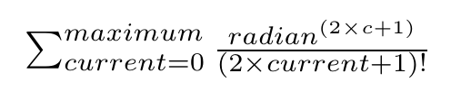

# Trigonometric Functions
Analysis and thinking about trigonometry functions and how they work.

## Sine

### Maximum

#### maximum = 1

| Degree  | Radian | 	Response 	   |	 Expected response 	   |
| ------- | ------ | ----------------- | ------------------------- |
| 0       |        | 0                 |                           |
| 20      |        | 0.349066           |                           |
| 45      |        | 0.875398          |                           |
| 80      |        | 1.39626          |                           |
| 90      |        | 1.5708                 |                           |
| 120     |        | 2.0944          |                           |
| 180     |        | 3.14159        |                           |
| 270     |        | 4.71239         |                           |
| 360     |        | 0                 |                           |

#### maximum = 7

| Degree  | Radian | 	Response 	   |	 Expected response 	   |
| ------- | ------ | ----------------- | ------------------------- |
| 0       |        | 0                 |                           |
| 20      |        | 0.34202           |                           |
| 45      |        | 0.707107          |                           |
| 80      |        | 0.984808          |                           |
| 90      |        | 1                 |                           |
| 120     |        | 0.866031          |                           |
| 180     |        | 0.00105761        |                           |
| 270     |        | -0.789398         |                           |
| 360     |        | 0                 |                           |

#### maximum = 15

| Degree  | Radian | 	Response 	   |	 Expected response 	   |
| ------- | ------ | ----------------- | ------------------------- |
| 0       |        | 0                 |                           |
| 20      |        | 0.34202           |                           |
| 45      |        | 0.707107          |                           |
| 80      |        | 0.984782          |                           |
| 90      |        | 0.999408                 |                           |
| 120     |        | -1.08921          |                           |
| 180     |        | -227481        |                           |
| 270     |        | -2.79025e+010         |                           |
| 360     |        | 0                 |                           |

#### maximum = 17

| Degree  | Radian | 	Response 	   |	 Expected response 	   |
| ------- | ------ | ----------------- | ------------------------- |
| 0       |        | 0                 |                           |
| 20      |        | 0.34202           |                           |
| 45      |        | 0.707107          |                           |
| 80      |        | 0.984711          |                           |
| 90      |        | 0.9964                 |                           |
| 120     |        | -31.5645          |                           |
| 180     |        | -1.55808e+007        |                           |
| 270     |        | -8.70732e+012         |                           |
| 360     |        | 0                 |                           |

#### maximum = 20

| Degree  | Radian | 	Response 	   |	 Expected response 	   |
| ------- | ------ | ----------------- | ------------------------- |
| 0       |        | 0                 |                           |
| 20      |        | 0.34202           |                           |
| 45      |        | 0.707107          |                           |
| 80      |        | 0.984808          |                           |
| 90      |        | 1                 |                           |
| 120     |        | 0.866025          |                           |
| 180     |        | -5.28918e-010        |                           |
| 270     |        | -1         |                           |
| 360     |        | 0                 |                           |

#### maximum = 40

| Degree  | Radian | 	Response 	   |	 Expected response 	   |
| ------- | ------ | ----------------- | ------------------------- |
| 0       |        | 0                 |                           |
| 20      |        | 0.34202           |                           |
| 45      |        | 0.707107          |                           |
| 80      |        | 0.984808          |                           |
| 90      |        | 1                 |                           |
| 120     |        | 0.866025          |                           |
| 180     |        | 3.32806e-016        |                           |
| 270     |        | -1         |                           |
| 360     |        | 0                 |                           |

## Cosine

## Tangent

## Cotangent
