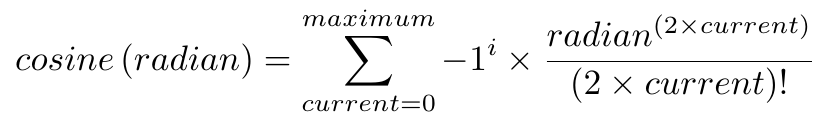

# Trigonometric Functions
Analysis and thinking about trigonometry functions and how they work.

## Sine


```
\begin{equation}
  sine \left(radian\right) = 
  \sum_{current=0}^{maximum}{
    -1 ^ i  \times
    \frac{
      radian ^ {\left( 2\times current +1 \right)}
    }{
      \left( 2 \times current + 1 \right) !
    }
  }
\end{equation}
```

### Maximum

#### maximum = 1

| Degree  | Radian | 	Response 	   |	 Expected response 	   | Correct answer |
| ------- | ------ | ----------------- | ------------------------- | ---------- |
| 0       |        | 0                 |  0                         | [x] |
| 20      |        | 0.349066           | 0.342020143                          | [ ] |
| 45      |        | 0.875398          |  0.707106781                         | [ ] |
| 80      |        | 1.39626          | 0.984807753                          | [ ] |
| 90      |        | 1.5708                 | 1                          | [ ] |
| 120     |        | 2.0944          | 0.866025404                          | [ ] |
| 180     |        | 3.14159        | 0                          | [ ] |
| 270     |        | 4.71239         | −1                          | [ ] |
| 360     |        | 0                 | 0                          | [x] |

#### maximum = 7

| Degree  | Radian | 	Response 	   |	 Expected response 	   | Correct answer |
| ------- | ------ | ----------------- | ------------------------- | --------- |
| 0       |        | 0                 | 0                          | [x] |
| 20      |        | 0.34202           | 0.342020143                          | [x] |
| 45      |        | 0.707107          | 0.707106781                          | [x] |
| 80      |        | 0.984808          | 0.984807753                          | [x] |
| 90      |        | 1                 | 1                          | [x] |
| 120     |        | 0.866031          | 0.866025404                          | [x] |
| 180     |        | 0.00105761        | 0                          | [ ] |
| 270     |        | -0.789398         | −1                          | [ ] |
| 360     |        | 0                 | 0                          | [x] |


#### maximum = 15

| Degree  | Radian | 	Response 	   |	 Expected response 	   | Correct answer |
| ------- | ------ | ----------------- | ------------------------- | -------- |
| 0       |        | 0                 | 0                          | [x] |
| 20      |        | 0.34202           | 0.342020143                          | [x] |
| 45      |        | 0.707107          | 0.707106781                          | [x] |
| 80      |        | 0.984782          | 0.984807753                          | [x] |
| 90      |        | 0.999408                 | 1                          | [ ] |
| 120     |        | -1.08921          | 0.866025404                          | [ ] |
| 180     |        | -227481        | 0                          | [ ] |
| 270     |        | -2.79025e+010         | −1                          | [ ] |
| 360     |        | 0                 | 0                          | [x] |

#### maximum = 17

| Degree  | Radian | 	Response 	   |	 Expected response 	   | Correct answer |
| ------- | ------ | ----------------- | ------------------------- | ------------ |
| 0       |        | 0                 | 0                          | [x] |
| 20      |        | 0.34202           | 0.342020143                          | [x] |
| 45      |        | 0.707107          | 0.707106781                          | [x] |
| 80      |        | 0.984711          | 0.984807753                          | [x] |
| 90      |        | 0.9964                 | 1                          | [ ] |
| 120     |        | -31.5645          | 0.866025404                          | [ ] |
| 180     |        | -1.55808e+007        | 0                          | [ ] |
| 270     |        | -8.70732e+012         | −1                          | [ ] |
| 360     |        | 0                 | 0                          | [x] |


#### maximum = 20

| Degree  | Radian | 	Response 	   |	 Expected response 	   | Correct answer |
| ------- | ------ | ----------------- | ------------------------- | ---- |
| 0       |        | 0                 | 0                          | [x] |
| 20      |        | 0.34202           | 0.342020143                          | [x] |
| 45      |        | 0.707107          | 0.707106781                          | [x] |
| 80      |        | 0.984808          | 0.984807753                          | [x] |
| 90      |        | 1                 | 1                          | [x] |
| 120     |        | 0.866025          | 0.866025404                          | [x] |
| 180     |        | -5.28918e-010        | 0                          | [ ] |
| 270     |        | -1         | −1                          | [x] |
| 360     |        | 0                 | 0                          | [x] |


#### maximum = 40

| Degree  | Radian | 	Response 	   |	 Expected response 	   | Correct answer |
| ------- | ------ | ----------------- | ------------------------- | -------------- |
| 0       |        | 0                 | 0                          | [x] |
| 20      |        | 0.34202           | 0.342020143                          | [x] |
| 45      |        | 0.707107          | 0.707106781                          | [x] |
| 80      |        | 0.984808          | 0.984807753                          | [x] |
| 90      |        | 1                 | 1                          | [x] |
| 120     |        | 0.866025          | 0.866025404                          | [x] |
| 180     |        | 3.32806e-016        | 0                          | [ ] |
| 270     |        | -1         | −1                          | [x] |
| 360     |        | 0                 | 0                          | [x] |


## Cosine



```
\begin{equation}
  cosine \left(radian\right) = 
  \sum_{current=0}^{maximum}{
    -1 ^ i  \times
    \frac{
      radian ^ {\left( 2\times current \right)}
    }{
      \left( 2 \times current \right) !
    }
  }
\end{equation}
```

## Tangent


```
\begin{equation}
  tangent\left(radian\right) = 
  \sum_{current=0}^{maximum}{
    -1 ^ i  \times
    \frac{
      \frac{
        radian ^ {\left( 2\times current \right)}
      }{
        \left( 2 \times current \right) !
      }
    }{
      \frac{
        radian ^ {\left( 2\times current +1 \right)}
      }{
        \left( 2 \times current + 1 \right) !
      }
    }
  }
\end{equation}
```

## Cotangent

-----------

The formulas picture created using [Tex](https://tug.org/) (xelatex) on the Unix System.

